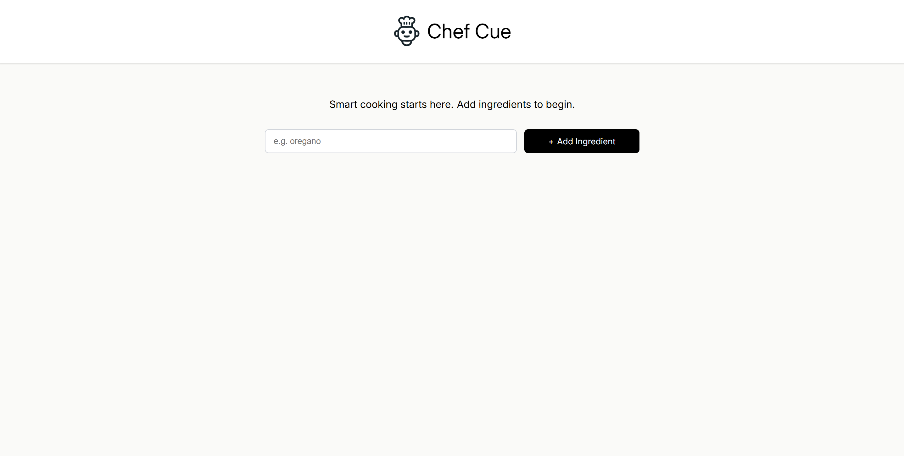
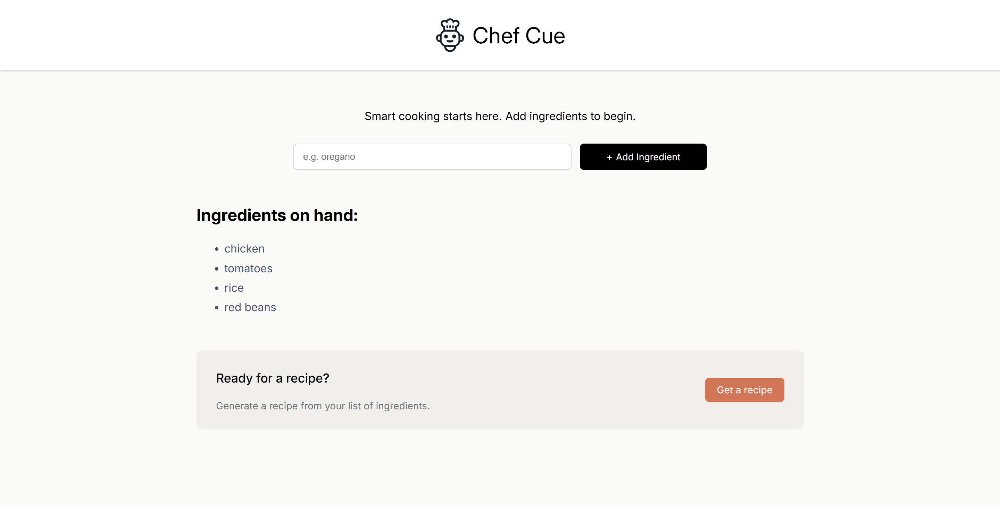
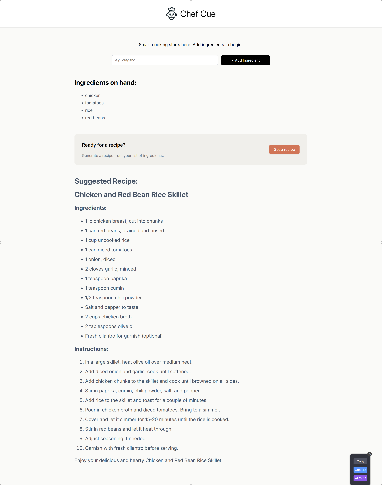

# Chef Cue 👨‍🍳🪄

**Chef Cue** is an intelligent recipe generator app built with React that helps users discover recipes based on the ingredients they already have. Powered by OpenAI's API, it acts as a smart kitchen assistant, saving time and reducing food waste by suggesting creative and feasible meal ideas.

---

## 📝 How It Works

1. **Input Ingredients**: Users can enter the ingredients they currently have in their kitchen.
2. **Smart Recipe Generation**: After entering a minimum of 4 ingredients, a "Get Recipe" button appears.
3. **AI-Powered Suggestions**: On clicking the button, the app sends the ingredients list to OpenAI's API, which acts as the AI chef.
4. **Recipe Markup Rendering**: The AI returns a formatted markup containing a recipe. This markup is then rendered and styled in the UI using the [`react-markup`](https://www.npmjs.com/package/react-markup) package.

---

## 🚀 Features

- ✅ Real-time ingredient input handling  
- 🧠 AI-generated recipe suggestions using OpenAI API  
- 🎨 Styled rendering of recipe markup using `react-markup`  
- 🍽️ Useful for meal planning and minimizing food waste  
- ⚛️ Built with React for a seamless UI experience  

---

## 🛠️ Tech Stack

- **React** – Frontend framework  
- **OpenAI API** – Recipe generation using gpt-3.5-turbo model 
- **react-markup** – Markup rendering of AI response  
- **CSS** – UI Styling  

---

## 📽️ Demo
Check out the live demo of the Chef Cue App [here](https://chef-cue-recipe.netlify.app/).

---

## 📸 Screenshots





---

## 🧰 Prerequisites

  1. Node.js and npm
  2. OpenAI API key

---

## 📦 Installation & Usage

1. **Clone the repo**:
   ```bash
   git clone https://github.com/the1fatkid/chef-cue-recipe.git
   ```

2. **Navigate to the Project Directory**:
    ```bash
    cd chef-cue-recipe
    ```

3. **Install Dependencies**:
    ```bash
    npm install
    ```

4. **Setup**: Create a `.env` file in the root directory and add your OpenAI API key
    ```env
    VITE_API_KEY=your-api-key-here
    ```

5. **Start the Development Server**:
    ```bash
    npm run dev
    ```

6. **Open the App**:
   Visit `http://localhost:5173` (or the URL specified by Vite) in your browser to interact with the app.

<br><br>

*Thanks for checking out Chef Cue! Hope it helps you cook up something delicious with what you already have in your kitchen. Happy cooking! 🍳🥦✨*


